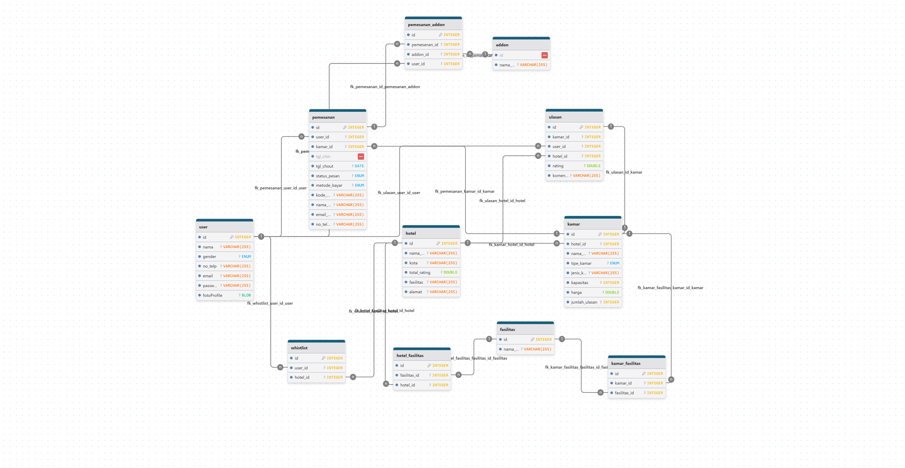

# BookyGo

BookyGo adalah aplikasi pemesanan hotel berbasis mobile yang membantu pengguna mencari hotel, melihat detail hotel dan kamar, menyimpan wishlist, melakukan pemesanan, memilih metode pembayaran, melihat riwayat booking, memberi ulasan, serta menerima notifikasi aktivitas dan reminder review.

Aplikasi ini terdiri dari dua bagian utama, yaitu frontend Flutter sebagai aplikasi mobile dan backend Laravel API sebagai pengelola autentikasi, data hotel, data kamar, booking, wishlist, review, notifikasi, dan database.

---

## Anggota Kelompok

| Nama       | NPM       | Tanggung Jawab Fungsional                                |
| ---------- | --------- | -------------------------------------------------------- |
| [ISI NAMA] | [ISI NPM] | Autentikasi, login, register, Google Sign-In, profile    |
| [ISI NAMA] | [ISI NPM] | Home page, daftar hotel, pencarian hotel, detail hotel   |
| [ISI NAMA] | [ISI NPM] | Detail kamar, fasilitas kamar, review dan foto review    |
| [ISI NAMA] | [ISI NPM] | Booking, payment, booking history, receipt               |
| [ISI NAMA] | [ISI NPM] | Backend API, database, storage, notification, deployment |

---

## Link Project

* Repository GitHub: [ISI LINK GITHUB]
* Figma: [ISI LINK FIGMA]
* Backend Railway: https://9pbpbookygo-production.up.railway.app/api
* Video Demo/Presentasi: [ISI LINK VIDEO JIKA ADA]

---

## Tech Stack

### Frontend

* Flutter
* Dart
* Provider
* Shared Preferences
* Firebase Messaging
* Google Sign-In
* Flutter Local Notifications
* Geolocator
* PDF & QR Code

### Backend

* Laravel
* Laravel Sanctum
* MySQL
* Firebase Cloud Messaging
* Railway Deployment
* Laravel Storage

---

## ERD

Berikut adalah Entity Relationship Diagram dari database BookyGo:



---

## Fitur Aplikasi

* Register, login, logout, dan login menggunakan Google.
* Edit profile dan upload foto profile.
* Melihat daftar hotel.
* Mencari hotel berdasarkan nama, kota, atau alamat.
* Melihat detail hotel beserta foto, fasilitas, lokasi, dan daftar kamar.
* Melihat detail kamar, harga, kapasitas, jenis kasur, fasilitas, dan foto kamar.
* Menambahkan hotel ke wishlist.
* Melakukan pemesanan kamar berdasarkan tanggal check-in, check-out, jumlah kamar, dan jumlah tamu.
* Memilih add-on tambahan.
* Memilih metode pembayaran.
* Melihat riwayat pemesanan.
* Melihat detail booking dan receipt.
* Membuat QR receipt berdasarkan data booking.
* Memberikan ulasan berupa rating, komentar, dan foto.
* Menandai ulasan sebagai helpful.
* Menerima notifikasi aktivitas dan reminder review.
* Menampilkan popup notifikasi menggunakan Firebase Cloud Messaging.
* Menampilkan kondisi error ketika koneksi/API bermasalah.

---

## Data Add-On

Data add-on yang digunakan pada aplikasi:

| Add-On    |    Harga |
| --------- | -------: |
| Breakfast | Rp60.000 |
| Laundry   | Rp60.000 |

Data add-on disiapkan melalui seeder agar dapat digunakan pada database lokal maupun database Railway.

---

## Struktur Project

```text
9_PBP_BookyGo
├── backend
│   ├── app
│   ├── database
│   ├── routes
│   ├── storage
│   └── ...
├── frontend
│   ├── android
│   ├── assets
│   ├── lib
│   └── ...
├── docs
│   └── erd-bookygo.png
└── README.md
```

---

## Cara Menjalankan Project

### Backend Laravel

Masuk ke folder backend:

```bash
cd backend
```

Install dependency:

```bash
composer install
```

Buat file `.env`:

```bash
copy .env.example .env
```

Atur konfigurasi database lokal:

```env
DB_CONNECTION=mysql
DB_HOST=127.0.0.1
DB_PORT=3306
DB_DATABASE=9_pbp_bookygo
DB_USERNAME=root
DB_PASSWORD=
```

Generate application key:

```bash
php artisan key:generate
```

Jalankan migration dan seeder:

```bash
php artisan migrate:fresh --seed
```

Buat storage link:

```bash
php artisan storage:link
```

Jalankan server backend:

```bash
php artisan serve --host=0.0.0.0 --port=8000
```

---

### Frontend Flutter

Masuk ke folder frontend:

```bash
cd frontend
```

Install dependency:

```bash
flutter pub get
```

Jalankan aplikasi menggunakan API lokal:

```bash
flutter run --dart-define=BOOKYGO_API_BASE_URL=http://IP-LAPTOP:8000/api
```

Contoh:

```bash
flutter run --dart-define=BOOKYGO_API_BASE_URL=http://192.168.1.10:8000/api
```

Jalankan aplikasi menggunakan API Railway:

```bash
flutter run --dart-define=BOOKYGO_API_BASE_URL=https://9pbpbookygo-production.up.railway.app/api
```

Build APK release:

```bash
flutter build apk --release --dart-define=BOOKYGO_API_BASE_URL=https://9pbpbookygo-production.up.railway.app/api
```

---

## Cara Menjalankan dengan Database Lokal

Jika responsi menggunakan database lokal, jalankan backend dengan konfigurasi `.env` lokal, kemudian gunakan:

```bash
php artisan migrate:fresh --seed
php artisan storage:link
php artisan serve --host=0.0.0.0 --port=8000
```

Setelah backend lokal aktif, jalankan Flutter dengan IP laptop:

```bash
flutter run --dart-define=BOOKYGO_API_BASE_URL=http://IP-LAPTOP:8000/api
```

---

## Cara Menjalankan dengan Database Railway

Aplikasi juga dapat dijalankan menggunakan backend dan database Railway.

Endpoint production:

```text
https://9pbpbookygo-production.up.railway.app/api
```

Untuk menjalankan Flutter menggunakan API Railway:

```bash
flutter run --dart-define=BOOKYGO_API_BASE_URL=https://9pbpbookygo-production.up.railway.app/api
```

Catatan:

* Jangan menjalankan `php artisan migrate:fresh` pada database Railway.
* Jika ada migration baru pada Railway, gunakan:

```bash
php artisan migrate --force
```

* Jika hanya memperbarui data seeder, gunakan:

```bash
php artisan db:seed
```

---

## Kendala dan Solusi

| Kendala                                                                     | Solusi                                                                                                          |
| --------------------------------------------------------------------------- | --------------------------------------------------------------------------------------------------------------- |
| Frontend tidak dapat terhubung ke backend lokal saat dijalankan di HP fisik | Menggunakan IP laptop pada `BOOKYGO_API_BASE_URL` agar HP dapat mengakses backend lokal.                        |
| Perbedaan database lokal dan Railway                                        | Menyiapkan migration dan seeder agar struktur dan data utama dapat dibuat ulang pada database lokal.            |
| Foto review tidak tampil setelah deploy                                     | Menggunakan Laravel storage link dan Railway volume agar file upload dapat diakses melalui endpoint `/storage`. |
| File foto lama tidak terbaca karena Railway volume                          | Menambahkan file seed dan proses copy file ke storage saat deployment.                                          |
| Autentikasi endpoint pribadi perlu diamankan                                | Menggunakan Laravel Sanctum dan token login untuk endpoint yang membutuhkan user.                               |
| Satu pemesanan tidak boleh memiliki lebih dari satu review                  | Menambahkan validasi agar satu `pemesanan_id` hanya dapat memiliki satu ulasan.                                 |
| Notification page muncul tetapi popup notifikasi tidak tampil               | Menghubungkan Firebase Cloud Messaging, menyimpan `fcm_token`, dan menampilkan local notification pada Flutter. |
| Aplikasi perlu menangani kondisi koneksi gagal                              | Menambahkan error state dengan icon lost connection dan pesan error yang lebih ramah.                           |
| Aplikasi membutuhkan akses lokasi pengguna                                  | Menambahkan permission lokasi dan pengambilan koordinat menggunakan Geolocator.                                 |

---

## Akun Demo

| Jenis Login  | Email              | Password                      |
| ------------ | ------------------ | ----------------------------- |
| Manual Login | [ISI EMAIL DEMO]   | [ISI PASSWORD DEMO]           |
| Google Login | [ISI EMAIL GOOGLE] | Login menggunakan akun Google |

---

## Status Project

BookyGo sudah mendukung fitur utama pemesanan hotel, mulai dari autentikasi, daftar hotel, detail hotel dan kamar, wishlist, booking, payment, history, receipt, review, notifikasi, hingga backend deployment menggunakan Railway.
